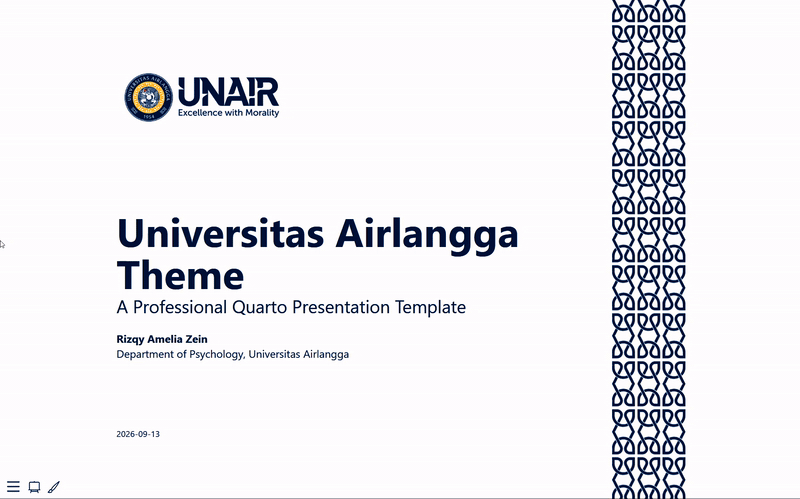

# Universitas Airlangga Quarto Presentation Theme

A reproducible Quarto Revealjs presentation theme following Universitas Airlangga's official 2025 corporate branding guidelines.

[](https://quarto.org)
[](https://opensource.org/licenses/MIT)

## ✨ Features

- ✅ **Official UNAIR Branding** - Colors, typography, and logo placement per 2025 brand guidelines
- ✅ **Professional Design** - Clean academic aesthetic for lectures and conferences
- ✅ **Smart Logo Management** - Automatic logo placement with white variant for dark backgrounds
- ✅ **Brand Sidebar** - Right-edge bar with the UNAIR key graphic, your talk's short title and the slide number, as in the guideline's page frame
- ✅ **Pre-styled Components** - Section headers, callouts, tables, and code blocks
- ✅ **10 Slide Layouts** - Section dividers, agenda, image bleeds, shaded box, 3 columns, image grid, two quote styles, and a closing slide
- ✅ **Easy Customization** - Simple to adapt while maintaining brand consistency

## 📸 Preview



See [`example.qmd`](https://rameliaz.github.io/quarto-unair-theme/) for a live demonstration of every slide layout.

## 🚀 Installation

### Quick Install (Recommended)

```bash
quarto use template rameliaz/quarto-unair-theme
```

This will create a new directory with the template and example presentation.

### Add to Existing Project

```bash
quarto add rameliaz/quarto-unair-theme
```

Then add `format: unair-revealjs` to your `.qmd` file's YAML header. See [`QUICKSTART.md`](QUICKSTART.md) for a 5-minute setup walkthrough.

> 📄 **Hosting on GitHub Pages:** the theme embeds its logos in each rendered page, so the slides work from any folder, with `output-dir`, and with `embed-resources: true`. GitHub Pages still runs your output through Jekyll unless the folder contains an empty `.nojekyll` file; Quarto recommends adding one. To have Quarto copy it in on every render, put the empty file in your project root and list it under `resources` in `_quarto.yml`:
> ```yaml
> project:
>   output-dir: docs
>   resources:
>     - .nojekyll
> ```

To pin a release instead of tracking the latest commit, add a tag: `quarto add rameliaz/quarto-unair-theme@v2.0.1`.

## 🧩 Slide Layouts

Put the class on the heading that starts the slide, e.g. `## Agenda {.agenda-slide}`. [`example.qmd`](example.qmd) has the full markup for each one.

| Layout | Markup |
|---|---|
| Section divider | `# Heading {background-color="#14497F"}`; add a `::: {.section-number}` block (e.g. `01`) for a big chapter number |
| Agenda | `## Agenda {.agenda-slide}` followed by a numbered list |
| Text + image | `## Title {.text-image}` with a two-column `::: columns` block, image in the second column |
| Image + text | `## {.image-text}`, image in the first column |
| Shaded box | `## Title {.text-slide-bg}` with `::: {.lead}` and `::: {.content-box}` blocks |
| Three columns | `## Title {.columns-slide}` with `::: {.columns-area}` holding three `::: {.col-item}` blocks |
| Image grid | `## Title {.overview-slide}` with `::: {.overview-grid}` holding three `::: {.overview-item}` blocks |
| Quote | `## Quote {.quote-slide}` with a `::: {.quote-bubble}` block (blockquote plus `::: {.quote-author}`) |
| Quote on a photo | `## Quote {.quote-slide-dark data-background-image="photo.jpg"}`, same content |
| Closing | `## Thank you! {.closing-slide}`, see below |

Only level-1 headings (`#`) with a `background-color` become section dividers. A `## Heading {background-color="..."}` slide keeps the normal content layout. On a dark colour it switches to white text and the white logo.

## 🎨 Brand Sidebar

Content slides get a bar on the right edge of the screen: the UNAIR key graphic at the top, your talk's short title running up the middle, and the slide number on a yellow block at the bottom. It's left off the title slide, section dividers, quote slides, the agenda and the closing slide.

Set the short title in the YAML header:

```yaml
title: "Open Science Practices and Replication Rates in Psychological Research"
short-title: "Open Science & Replication"
```

Without `short-title`, the full `title` is used and cut off with "…" if it doesn't fit. The number only appears when `slide-number: true` is set.

To hide the sidebar on a single slide, add `.no-sidebar`:

```markdown
## Full-width chart {.no-sidebar}
```

## 👋 Closing Slide

A cover-style final slide modeled on the UNAIR guideline's front page: blue page, white logo, big title, and the yellow batik strip on the right. All three blocks are optional.

```markdown
## Thank you! {.closing-slide}

::: {.closing-subtitle}
Questions?
:::

::: {.closing-contact}
- [ ]{.fa-solid .fa-envelope .fa-fw} [name@unair.ac.id](mailto:name@unair.ac.id)
:::

::: {.closing-note}
Slides at github.com/you/talk
:::
```

## 📊 PowerPoint Version

Not using Quarto? The same design is available as a PowerPoint template, with the brand sidebar, the batik-strip title and closing slides, and the layouts from the Quarto theme.

- ⬇️ [**unair-template.potx**](https://github.com/rameliaz/quarto-unair-theme/raw/main/pptx/unair-template.potx): the template. Open it and PowerPoint starts a new, untitled presentation based on it.
- ⬇️ [**unair-sample.pptx**](https://github.com/rameliaz/quarto-unair-theme/raw/main/pptx/unair-sample.pptx): a 15-slide sample deck that uses every layout, for reference.

Add slides with **Home → New Slide** and pick a layout: Title, Section Divider, Content, Two Content, Title Only, Content (no sidebar), Agenda, Text + Image, Image + Text, Text + Shaded Box, Three Columns, Overview Grid, Quote, Quote (Dark / Photo) or Closing. The running title in the sidebar is the slide footer: **Insert → Header & Footer**, tick *Footer*, type the short title and click **Apply to All**. See [`pptx/README.md`](pptx/README.md) for more.

The template uses Segoe UI, which comes with Windows. On a Mac, install [Inter](https://fonts.google.com/specimen/Inter), the guideline's alternative typeface, or PowerPoint will substitute another font.

Both files are generated from [`pptx/src/`](pptx/src/). To rebuild them after changing the design, you need Node.js and Python. `package-lock.json` and `requirements.txt` pin the dependency versions, so rebuilds are repeatable:

```bash
cd pptx/src && npm ci && pip install -r requirements.txt && npm run build
```

The build script calls `python`; where only `python3` exists (some macOS/Linux setups), run `node assets.js && python3 build.py` instead.

## 🛠️ Troubleshooting

**No logo on the slides.** The logos are embedded by `unair.lua` at render time. If you see the warning `unair: could not read logo.png`, the extension folder is incomplete: reinstall with `quarto add rameliaz/quarto-unair-theme`. Theme versions before 2.0.1 loaded the logos from `_extensions/` next to the rendered page, which broke with `output-dir`, decks in subfolders and `embed-resources`; update the extension if you still see that.

**Broken layout on GitHub Pages.** Add an empty `.nojekyll` file to the published folder (see *Hosting on GitHub Pages* above).

**Wrong font.** The theme uses Segoe UI where it's installed (Windows) and loads Inter from Google Fonts elsewhere. Offline, or where Google Fonts is blocked, the browser falls back to a system sans-serif; install Inter locally to avoid that.

**Icons missing.** The Font Awesome icons (and the Inter font) load from a CDN, so they need an internet connection. To present offline, render with `embed-resources: true`, which saves them into the HTML file.

**Text cut off on a quote or agenda slide.** Long quotes and long agenda items shrink to fit, down to half (quotes) or 40% (agenda) of their normal size. Anything longer than that is still cut off: shorten the text or split the slide.

## 🏗️ Project Structure

```
quarto-unair-theme/
├── _extensions/
│   └── unair/
│       ├── _extension.yml      # Extension registration
│       ├── airlangga.scss      # Theme styles (SCSS)
│       ├── theme.html          # Logo, sidebar and shrink-to-fit JS
│       ├── unair.lua           # Embeds the logos and passes `short-title` to theme.html
│       ├── keygraphic.svg      # UNAIR key graphic (source of the sidebar icon)
│       ├── keypattern.svg      # Batik pattern tile (source of the title/closing-slide strip)
│       ├── logo.png            # Regular logo
│       └── logo_white.png      # White logo (dark backgrounds)
├── img/
│   └── snapshot.gif            # Preview animation
├── pptx/
│   ├── unair-template.potx      # PowerPoint template
│   ├── unair-sample.pptx        # Sample deck using every layout
│   └── src/                     # Build scripts for both files
├── docs/                       # Rendered GitHub Pages output
├── example.qmd                 # Working demo presentation
├── _quarto.yml                 # Config for the GitHub Pages demo (not copied by `quarto use template`)
├── .quartoignore               # Files `quarto use template` leaves out
├── README.md
├── QUICKSTART.md                # 5-minute setup guide
├── CHANGELOG.md                 # Version history
└── LICENSE
```

## 📄 License

MIT License - see [LICENSE](LICENSE) for details. The UNAIR logo and brand elements remain property of Universitas Airlangga. I prompted Claude Sonnet 5 and Opus 5 to improve the theme.